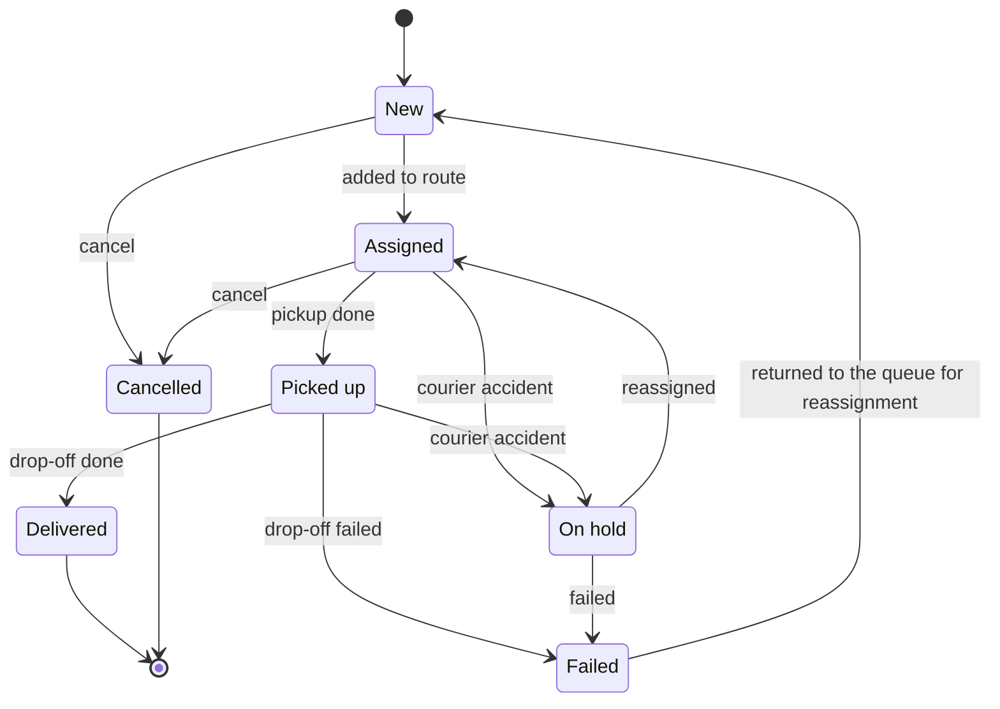
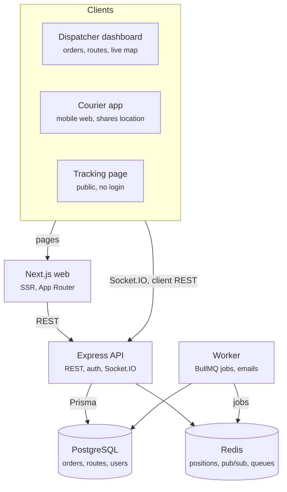

# Flock — Technical Specification

Created 2026-10-05 · last updated 2026-10-06 · Jane

## Overview

A multi-tenant SaaS for small delivery services: dispatchers plan routes and schedule deliveries, couriers work through a mobile-friendly web app, and customers follow their order on a live map. A delivery business subscribes and the platform sets up its own company workspace with its admins and settings; each company works only with its own data, side by side with others on the same platform.

**Goal.** A production-grade full-stack portfolio product that demonstrates Node.js/Express, PostgreSQL, real-time features and server-side rendering, deployed and usable through a public demo account.

**MVP scope.** Separate company workspaces with roles, order management, routes with several stops per courier, scheduled deliveries, live courier tracking, a public tracking page, accident handling, an event log and a statistics page with charts.

**Name.** Flock. Couriers as a flock of birds flying out across the city, a nod to pigeon post; the name stays neutral about the vehicle.

## Users and roles

Four roles; every staff user belongs to exactly one company (tenant), and data never crosses tenants. The company is a background entity: users belong to it, but no one creates, deletes or switches companies in the app; the Admin only edits its settings.

| Role       | Signs in | Can do                                                                                                                                                                                                                                                           |
| ---------- | -------- | ---------------------------------------------------------------------------------------------------------------------------------------------------------------------------------------------------------------------------------------------------------------- |
| Admin      | Yes      | Manage company settings, users and roles, assign couriers to dispatchers, see everything across all dispatchers, including each dispatcher’s statistics                                                                                                          |
| Dispatcher | Yes      | Create and edit orders, pick orders from the shared pool, build routes and schedule deliveries for their own couriers, watch them on the live map, handle their accidents, see their statistics and event log; sees only the couriers the Admin assigned to them |
| Courier    | Yes      | See own routes and stops, update stop statuses, share location while on shift, attach proof of delivery, report an accident                                                                                                                                      |
| Customer   | No       | Open a tracking link, see status, ETA and courier position on the map                                                                                                                                                                                            |

Authorization is role-based (RBAC) and checked on the API for every request, not only in the UI. A dispatcher’s access is further scoped to their own couriers, those couriers’ routes and locations, plus the shared pool of unassigned orders.

## Functional requirements

The core is orders grouped into courier routes; everything else (scheduling, tracking, notifications) hangs off that.

**Authentication and accounts**

- Email and password sign-in, JWT access token plus refresh token in an httpOnly cookie
- Admin invites users by email and assigns a role
- Public demo company with seeded data and one-click demo logins per role, reset and reseeded nightly with the past week of order history, so the statistics charts and event log are never empty
- No public sign-up: companies are provisioned by the platform with a CLI script that also creates the first Admin
- A new company starts with sample data (couriers, vehicles, orders, routes) so it is not empty; real data is added alongside, and the Admin can hide sample data or delete it in one action from settings

**Orders**

- Create, edit, cancel an order: customer name and phone, pickup and drop-off address, notes, package weight and dimensions (length, width, height)
- Address geocoding to coordinates (free provider, OpenStreetMap Nominatim)
- Delivery type: ASAP, or scheduled with a pickup time window and a drop-off time window (for example pickup 12:00–13:00, drop-off 14:00–16:00); the drop-off window cannot start before the pickup window
- Unassigned orders form a shared pool that every dispatcher in the company sees and picks from; once an order is on a route, only that courier’s dispatcher (and the Admin) sees it
- Order list with server-side filtering, sorting, search and pagination

**Routes: several deliveries per courier**

- A route belongs to one courier and one vehicle for one shift (a courier is not tied to a vehicle and can use a bicycle, scooter or car on different shifts) and holds an ordered list of stops
- Each order adds a pickup stop and a drop-off stop; a pickup always comes before its drop-off
- Dispatcher builds a route by assigning orders and reorders stops by drag and drop
- ETA per stop comes from the routing service (travel time for the vehicle type’s profile) and is recalculated when the order of stops or the courier position changes
- A route must fit into one working day: its total duration (travel plus handling time at each stop) cannot exceed the company’s shift length; the API rejects stop assignments or reorders that break this
- Route optimization (suggested stop order) is out of MVP scope, manual ordering first

**Scheduled deliveries**

- Orders with a time window go to a planning board by day
- A route can be created in advance for a future shift
- Background jobs: remind the dispatcher about unassigned orders before their window, flag stops at risk of missing the window

**Courier app (mobile-first web)**

- Today’s route as a list and a map, next stop highlighted
- Start shift / end shift; location shared every few seconds while on shift
- Stop actions: arrived, delivered, failed with reason; proof of delivery photo
- Report an accident: one button with a confirmation step; sends the current location and an optional comment

**Courier accident**

- The courier gets the status Accident and cannot be added to any route until an Admin or Dispatcher clears it
- Orders on the courier’s future routes lose the courier and go back to the shared pool of unassigned orders
- Orders on the courier’s current route get the status On hold; the dispatcher then either marks each one Failed or reassigns it to another courier
- For a reassigned order that was already picked up, the new courier gets a pickup stop at the accident location; one not yet picked up keeps its original pickup address
- The courier’s dispatcher and the Admin get an urgent in-app notification; every accident is stored as an Incident with when it was reported and who cleared it

**Live tracking**

- Dispatcher live map: all couriers on shift, their routes drawn along roads and stop statuses, updated in real time
- Public tracking page per order (unguessable link): status, ETA, courier on the map only while the courier is heading to that stop
- Courier simulator: a worker job drives sample couriers along their route geometry at their vehicle type’s speed, sending locations and stop events (arrived, delivered, occasionally failed, rarely an accident) through the same API as the real courier app; it never touches real data

**Notifications**

- In-app notifications for dispatchers (courier accident, shown as urgent; failed delivery, late stop, new unassigned order)
- Email to the customer when the order is out for delivery and when it is delivered

**Statistics**

- Dispatcher, today’s load: how many of their couriers are busy today, how many deliveries are planned for today and how many are in progress
- Dispatcher, this week’s orders: delivered, not delivered, in progress, unassigned (the unassigned count is the shared pool, so it is the same for every dispatcher)
- Admin opens the same page with a dispatcher filter: picking a name shows exactly what that dispatcher sees
- Days and weeks are counted in the company’s timezone, weeks start on Monday; numbers are SQL aggregates computed on request. Shown as totals plus charts: a donut of busy and free couriers today, and a stacked bar chart of the week’s orders by day and status

**Event log**

- Every meaningful action is written to an append-only log: order created, edited, cancelled; order assigned, reassigned or returned to the pool; stop arrived, delivered, failed; shift started and ended; accident reported and cleared; courier assigned to a dispatcher; user invited
- Each entry records who did it (user or system), when, what it applies to (order, courier, route) and the details
- Event log page with filters by type, courier, order and date range; accidents can be shown on their own
- Admin sees the whole company’s log; a dispatcher sees events about their own couriers and orders in the shared pool
- An order and a courier page each show their own history from the same log

## Order and route lifecycle

An order moves forward only through stop events, so its status is always derived from what the courier did.

Delivered and Cancelled are final. Scheduled orders stay in New until the dispatcher adds them to a route for that day. Stops have their own statuses (pending → arrived → completed or failed); a route is planned, active once the courier starts the shift, and completed when every stop is closed. A courier accident moves the orders on the courier’s current route to On hold; from there the dispatcher marks them Failed or reassigns them, which puts them back on a route.

## Data model

Every table except Company carries a `companyId`; all queries are scoped by it. Users, Vehicles, Orders and Routes also carry `isSample`, which marks seeded sample data so it can be hidden or deleted.

| Entity          | Key fields                                                                                                                                                                                                                        | Relations                                                                                                   |
| --------------- | --------------------------------------------------------------------------------------------------------------------------------------------------------------------------------------------------------------------------------- | ----------------------------------------------------------------------------------------------------------- |
| Company         | name, timezone, shiftLengthMin, pickupHandlingMin, dropoffHandlingMin, settings                                                                                                                                                   | has many Users, Vehicles, Orders, Routes                                                                    |
| User            | email, passwordHash, name, role (admin, dispatcher, courier), dispatcherId (couriers only, set by the Admin), courierStatus (available, accident)                                                                                 | belongs to Company; a dispatcher has many couriers; a courier belongs to one dispatcher and has many Routes |
| Vehicle         | vin, legalNumber, color, type (bicycle, scooter, car, van); each type has a fixed max load weight and max package dimensions (lookup in packages/shared)                                                                          | belongs to Company; not tied to a courier, picked per Route                                                 |
| Order           | customer name and phone, pickup and drop-off address with lat/lng, weightKg, lengthCm, widthCm, heightCm, type (asap, scheduled), pickupWindowStart, pickupWindowEnd, dropoffWindowStart, dropoffWindowEnd, status, trackingToken | has two Stops                                                                                               |
| Route           | courierId, vehicleId, shiftDate, status, distanceM, durationMin, geometry (cached from the routing service)                                                                                                                       | uses one Vehicle; has many Stops, ordered                                                                   |
| Stop            | routeId, orderId, kind (pickup, dropoff), lat, lng (from the order, or the accident location for a re-pickup), sequence, eta, status, arrivedAt, completedAt, failReason                                                          | belongs to Route and Order                                                                                  |
| CourierLocation | courierId, lat, lng, recordedAt                                                                                                                                                                                                   | latest position cached in Redis; history kept for the active shift                                          |
| Incident        | courierId, routeId, lat, lng, comment, reportedAt, resolvedAt, resolvedById                                                                                                                                                       | belongs to a courier (User) and the Route active at the time                                                |
| ProofOfDelivery | stopId, photoUrl, createdAt                                                                                                                                                                                                       | belongs to Stop                                                                                             |
| Notification    | userId, type, payload, readAt                                                                                                                                                                                                     | belongs to User                                                                                             |
| Event           | type, actorId (null for system), entityType, entityId, courierId, payload, createdAt; append-only                                                                                                                                 | belongs to Company; points at the Order, Route, User or Incident it describes                               |

Constraint: within a route, an order’s pickup stop sequence is lower than its drop-off stop sequence.

Constraint: the total weight of orders on a route must not exceed the max load of its vehicle type, and every order must fit within that type's max package dimensions; the API rejects an assignment that breaks either rule.

Constraint: a route’s durationMin (travel time from the routing service plus stopHandlingMin per stop) is at most the company’s shiftLengthMin; deliveries spanning more than one day are not supported.

## Architecture and tech stack

A modular monolith: one Express API, a Next.js web app for server-side rendering, and a background worker, all in one TypeScript monorepo. No microservices in the MVP.

Next.js renders pages on the server by calling the API; the browser talks to the API directly only for real-time updates and client-side mutations. The worker shares the API’s code and database access but runs separately, so slow jobs never block requests.

| Layer    | Choice                                                                                                                                                                                                                                                                                                                                                                      |
| -------- | --------------------------------------------------------------------------------------------------------------------------------------------------------------------------------------------------------------------------------------------------------------------------------------------------------------------------------------------------------------------------- |
| Monorepo | pnpm workspaces: `apps/web`, `apps/api`, `apps/worker`, `apps/e2e`, `packages/shared`                                                                                                                                                                                                                                                                                       |
| Web      | Next.js (App Router, Server Components), TypeScript, TanStack Query for client data, Tailwind, Leaflet + OpenStreetMap                                                                                                                                                                                                                                                      |
| Charts   | Recharts (React, TypeScript): donut and stacked bar chart on the statistics page                                                                                                                                                                                                                                                                                            |
| API      | Node.js, Express, TypeScript, Zod, Socket.IO, pino                                                                                                                                                                                                                                                                                                                          |
| Data     | PostgreSQL + Prisma; Redis for latest courier positions, Socket.IO adapter and queues                                                                                                                                                                                                                                                                                       |
| Routing  | OpenRouteService free tier: road geometry, distance and travel time per vehicle profile (car and van use driving; bicycle uses cycling; scooter uses driving with highways avoided and travel time multiplied by a slowdown factor, 1.3 by default, since scooters may not use bike lanes); behind a RoutingProvider interface so self-hosted OSRM in Docker can replace it |
| Jobs     | BullMQ (delayed jobs for scheduled reminders, courier simulator, nightly demo reset)                                                                                                                                                                                                                                                                                        |
| Local    | Docker Compose for Postgres and Redis                                                                                                                                                                                                                                                                                                                                       |
| Testing  | Vitest, Supertest, Playwright (UI e2e and black-box API tests)                                                                                                                                                                                                                                                                                                              |
| CI/CD    | GitHub Actions                                                                                                                                                                                                                                                                                                                                                              |

## API design

REST over JSON, versioned under `/api/v1`, documented with OpenAPI (Swagger UI at `/api/docs`); real-time updates go over Socket.IO.

**Why REST, not GraphQL.** GraphQL with Apollo is already on the CV, while REST + OpenAPI, validation and typed clients appear in most fullstack vacancies. The data is resource-shaped (orders, routes, stops), and real-time needs are covered by WebSockets, so GraphQL subscriptions add little.

**Resources**

| Resource      | Main endpoints                                                                                                                                                      |
| ------------- | ------------------------------------------------------------------------------------------------------------------------------------------------------------------- |
| Auth          | `POST /auth/login`, `POST /auth/refresh`, `POST /auth/logout`, `GET /auth/me`                                                                                       |
| Users         | `GET /users`, `POST /users/invite`, `PATCH /users/:id`                                                                                                              |
| Vehicles      | `GET /vehicles`, `POST /vehicles`, `PATCH /vehicles/:id`                                                                                                            |
| Orders        | `GET /orders`, `POST /orders`, `GET /orders/:id`, `PATCH /orders/:id`, `POST /orders/:id/cancel`                                                                    |
| Routes        | `GET /routes?date=`, `POST /routes`, `GET /routes/:id`, `PUT /routes/:id/stops` (assign and reorder)                                                                |
| Stops         | `POST /stops/:id/arrive`, `POST /stops/:id/complete`, `POST /stops/:id/fail`, `POST /stops/:id/proof`                                                               |
| Couriers      | `POST /couriers/me/shift/start`, `POST /couriers/me/shift/end`                                                                                                      |
| Accidents     | `POST /couriers/me/accident`, `POST /couriers/:id/accident/resolve`, `POST /orders/:id/fail` (for orders on hold)                                                   |
| Tracking      | `GET /track/:token` (public)                                                                                                                                        |
| Notifications | `GET /notifications`, `POST /notifications/:id/read`                                                                                                                |
| Statistics    | `GET /stats/today`, `GET /stats/week` (the week includes a per-day breakdown for the chart; a dispatcher gets their own numbers; the Admin passes `?dispatcherId=`) |
| Events        | `GET /events?type=&courierId=&orderId=&from=&to=` (paginated)                                                                                                       |

**Real-time events (Socket.IO rooms per company and per order)**

| Event              | Direction                           | Payload                                            |
| ------------------ | ----------------------------------- | -------------------------------------------------- |
| `courier:location` | courier → server                    | lat, lng, timestamp                                |
| `courier:moved`    | server → dispatchers, tracking page | courierId, lat, lng                                |
| `stop:updated`     | server → dispatchers, tracking page | stopId, status, eta                                |
| `route:updated`    | server → dispatchers, courier       | routeId, stops                                     |
| `notification:new` | server → user                       | notification                                       |
| `courier:accident` | server → dispatchers                | courierId, incidentId, lat, lng, affected orderIds |

Request and response schemas live in a shared package (Zod) and are used for validation on the API, form validation in the web app and OpenAPI generation.

## Non-functional requirements

The bar is “could be shown to a client”: secure by default, tested, deployed automatically, and free to run.

- **Security:** bcrypt password hashes, short-lived access tokens, refresh token rotation, rate limiting on auth, Helmet, CORS allowlist, tenant scoping on every query
- **Validation and errors:** Zod on every input; one error format across the API; no stack traces in production
- **Testing:** unit tests for domain logic (Vitest), API integration tests against a test database (Supertest), and a Playwright test suite built like an automation QA framework:
  - `apps/e2e` workspace with Page Object Model, role-based auth fixtures (`storageState`) and test data created through the API, so tests are independent and run in parallel
  - UI e2e for key flows: sign in, create order, assign to route, deliver, report an accident and reassign its orders; a multi-role real-time test (dispatcher and courier in two browser contexts); mobile viewport for the courier view; a few visual snapshots
  - black-box API tests over HTTP with the Playwright request context: auth, RBAC per role, tenant isolation, error cases, responses validated against the shared Zod schemas
  - runs in CI on every PR with an HTML report, traces and video on failure
- **Code quality:** TypeScript strict mode, ESLint, Prettier, shared types between web and API
- **CI/CD:** GitHub Actions runs lint, type check and tests on every PR; deploy on merge to main
- **Local setup:** `docker compose up` starts Postgres and Redis; one command seeds the demo company
- **Observability:** structured logs (pino), health check endpoint
- **Cost:** free tiers only (managed Postgres, Redis, hosting for web and API, OpenStreetMap tiles and geocoding within usage policy)
- **Docs:** README with screenshots, architecture diagram, demo logins and local setup

## Milestones

Six milestones at about two hours a day; after milestone 4 the project is deployed and goes on the CV. Each milestone becomes an epic in the backlog ([GitHub Issues](https://github.com/Jeaninne/flock-app/issues)).

1. **Foundation:** monorepo, Docker Compose (Postgres, Redis), Express skeleton with error handling and logging, Prisma schema and migrations, seed script, CI with lint and type check
2. **Auth and orders:** JWT auth with refresh, company provisioning script, RBAC, user invites, couriers assigned to dispatchers, vehicles, orders CRUD with geocoding, Next.js dashboard with server-rendered order list and filters, OpenAPI docs, Playwright framework and its CI job
3. **Routes and scheduling:** routes with ordered stops, drag-and-drop stop ordering, routing service integration (road geometry, ETA, shift-length check), planning board by day, scheduled orders, BullMQ reminder jobs, black-box API tests
4. **Real-time and courier app:** Socket.IO, courier location sharing, dispatcher live map (Leaflet), courier mobile view with stop actions, public tracking page, courier simulator, deploy to production, Playwright e2e for key flows
5. **Operations:** accident reporting with On hold and reassignment, event log with filters, statistics page with Recharts charts, Admin’s dispatcher filter
6. **Polish and extras:** proof of delivery photos (S3-compatible storage), email notifications, sample data for new companies with hide and delete, landing page, README with screenshots, optional NestJS service (for example notifications)

**Out of scope for MVP:** automatic route optimization, payments, native mobile apps, multi-language UI, deliveries spanning more than one day, guided onboarding on sample data, billing per tenant.
